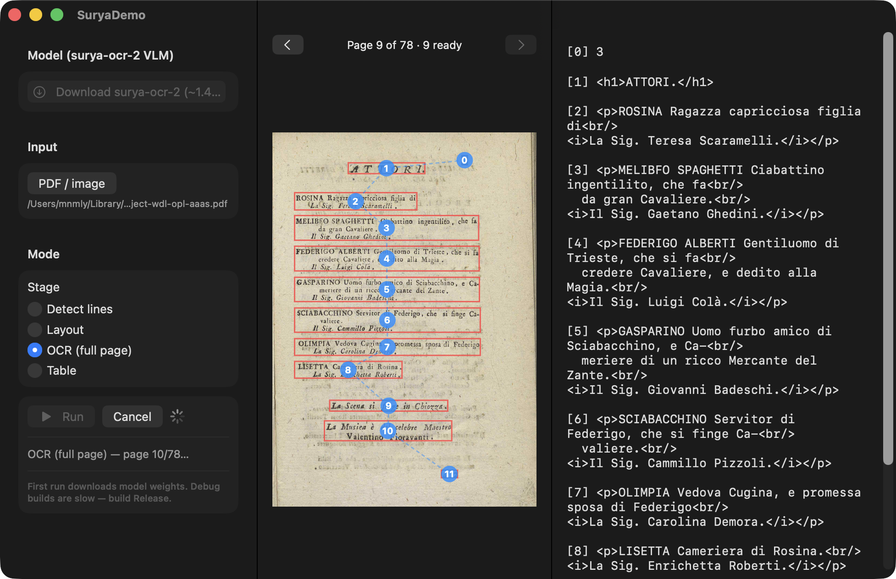

# mlx-swift-surya

A Swift / [MLX](https://github.com/ml-explore/mlx-swift) port of
[datalab-to/surya](https://github.com/datalab-to/surya) — OCR, layout analysis,
table recognition, and reading order in 90+ languages, running natively on Apple
Silicon.

📖 **[API documentation](https://mnmly.github.io/mlx-swift-surya/)** · 🏷 **[0.2.0 release](https://github.com/mnmly/mlx-swift-surya/releases/tag/0.2.0)**

> **Status: v0.2.0.** All three models are ported and verified end-to-end — the
> `surya-ocr-2` VLM (layout / OCR / table / reading order), native EfficientViT text
> detection, and the native DistilBERT OCR-error classifier — behind a shared
> `SuryaSession` driving both the `surya-cli` tool and the SuryaDemo SwiftUI app.
> v0.2.0 adds a `Structurer` that post-processes recognized blocks into a
> reading-ordered document — paragraphs stitched whole across page/column breaks and
> segmented into sentences (language-aware, so it holds up on non-English text).



> The `SuryaDemo` SwiftUI app: full-page OCR of a 78-page PDF, showing detected
> text lines, reading-order flow, and the structured HTML output.

## What surya actually is

surya 0.20 is **three independent components**, ported with three strategies:

| Component | Upstream | Swift strategy |
|---|---|---|
| **`surya-ocr-2`** — layout, table, recognition, reading order | a `qwen3_5` VLM, served via vLLM / llama.cpp / OpenAI | **Reuse `MLXVLM`** (same arch family as `mlx-swift-chandra`) + port prompts / preprocessing / parsers |
| **Text detection** | native PyTorch EfficientViT segmentation | **Native MLX port** (encoder + LiteMLA linear attention + decode head + heatmap→polygon) |
| **OCR-error** | native PyTorch DistilBERT classifier | **Native MLX port** + BertTokenizer |

All non-presentation work lives behind one library-side driver, `SuryaSession`,
consumed identically by the `surya-cli` executable and the `SuryaDemo` SwiftUI app
(the shared-driver pattern — the same engine drives both frontends).

## Build

This package uses MLX (Metal), so build/run with the **Xcode toolchain**, not the
bare `swift` CLI:

```bash
# Build everything (library + CLI)
xcodebuild -scheme mlx-swift-surya-Package -destination 'platform=macOS' \
  -derivedDataPath .xcdd build

# Run the CLI
.xcdd/Build/Products/Debug/surya-cli info

# Tests
xcodebuild -scheme mlx-swift-surya-Package -destination 'platform=macOS' test
```

## Roadmap

- [x] Package skeleton — `SuryaSession` API, Swift 6 concurrency, DocC, CLI, tests
- [x] **VLM slice** — surya-ocr-2 via `MLXVLM`: layout, full-page + per-block OCR, table rec
  - [x] Custom char-level `WordLevel` tokenizer (`SuryaWordLevelTokenizer`) + Jinja chat
        template — surya-ocr-2's tokenizer is unsupported by swift-transformers
  - [x] Prompts, image scale-to-fit, JSON/HTML parsers, pipeline + CLI (`layout`/`ocr`/`table`/`gen`)
- [x] **Document structuring** (`Structurer`) — recognized blocks → reading-ordered
      `StructuredDocument`: cross-page/column paragraph stitching, de-hyphenation, language
      detection + sentence segmentation, opt-in historical-orthography normalization;
      `surya-cli structure` (md/json) and a GUI Structure mode
  - [x] End-to-end verified on a real page (Attention Is All You Need)
- [x] **Native EfficientViT text detection** — encoder + LiteMLA linear attention + decode head
  - [x] PyTorch→NHWC weight conversion, SegFormer preprocessing, CRAFT heatmap→polygon postproc
  - [x] End-to-end verified (49 text-line boxes on a real page); weights auto-download from datalab
- [x] **Native DistilBERT OCR-error classifier** — embeddings + 6 transformer blocks + head
  - [x] WordPiece tokenizer via swift-transformers `AutoTokenizer.from(modelFolder:)`
  - [x] End-to-end verified (clean→good 0.99, garbled→bad 0.99); `surya-cli qa --text …`
- [x] **`SuryaDemo` SwiftUI app** on the shared `SuryaSession` (Detect / Layout / OCR / Structure /
      Table, box overlay, reading-order flow, all-pages streaming, page flipping, model-download UX)
- [x] **Release build + benchmark** — `surya-cli bench`; detection **0.53 s/page** (Release) vs
      ~367 s (Debug), **0 MB active-memory drift** (no leak)
- [x] **DocC site** (`Scripts/build_docs.sh`) built & deployed to GitHub Pages by Actions
      (`.github/workflows/docs.yml`, on push to `main`) → <https://mnmly.github.io/mlx-swift-surya/>
- [x] **Numerical parity vs Python** (`Scripts/parity/`, `surya-cli parity …`): OCR-error logits
      0.0027, detection heatmap 0.0037, VLM input_ids identical — caught & fixed a detection
      eval-mode (BatchNorm) bug
- [ ] Batched multi-page VLM decode for throughput (future)

## Performance

Release build, Apple Silicon, warm (first run includes model load):

| Stage | Release | Notes |
|---|---|---|
| Detection (EfficientViT) | ~0.5 s/page | `surya-cli bench --mode detect --input page.png` |
| OCR / Layout / Table (VLM) | ~26 s/page | decode-bound; ~15 GB peak at full resolution |

`surya-cli bench` reports MLX `active`/`cache`/`peak` memory each iteration — flat `active` ⇒ no leak.

### Speed / memory tuning (VLM)

Two knobs, both benchmarked. **OCR is decode-bound** (the model emits the same ~1500-token HTML
regardless of input), so neither speeds it up much — they trade **memory** and accuracy:

- `--precision int8` (`SuryaPrecision.int8`): quantizes the language model in-memory (vision stays
  full precision). ~40% less LM-weight memory, near-lossless — **not faster** (tiny text model).
- `--max-image-mp <MP>` (`SuryaConfiguration.maxImagePixels`; GUI "Image detail"): lowers the
  image-token budget. 6.3 → 1.5 MP cut OCR **peak memory ~15 GB → ~5 GB** with near-identical output
  on typical pages, but per-page time stayed flat. Use it for memory headroom on big multipage docs
  / smaller Macs, not for speed.

The remaining *throughput* lever is batched/parallel multi-page decode, which the single-sequence
`MLXVLM` generate path doesn't support (a separate backend project).

### Apps & CLI

Both frontends drive the same library-side `SuryaSession`:

```bash
# CLI
xcodebuild -scheme mlx-swift-surya-Package -destination 'platform=macOS' -derivedDataPath .xcdd build
.xcdd/Build/Products/Debug/surya-cli detect --input page.png

# SwiftUI app
xcodebuild -project Examples/SuryaDemo/SuryaDemo.xcodeproj -scheme SuryaDemo \
  -destination 'platform=macOS' build
```

## Documentation

API reference is published with DocC to GitHub Pages:
**<https://mnmly.github.io/mlx-swift-surya/>**

The site is built and deployed automatically by GitHub Actions (`.github/workflows/docs.yml`) on
every push to `main`, via `Scripts/build_docs.sh` (`swift package generate-documentation` +
`--transform-for-static-hosting`, with per-symbol "View on GitHub" source links). To build it
locally run `Scripts/build_docs.sh` — this needs a Swift toolchain matching the active SDK (a
mismatched bare `swift` fails to resolve; `Scripts/build_docs.sh preview` serves it with live
reload). `///` doc comments on public symbols are published, so keep them healthy when changing
the public API.

## License

Port scaffolding under this repo's license; the upstream surya models carry their
own [model license](https://github.com/datalab-to/surya/blob/master/MODEL_LICENSE).
